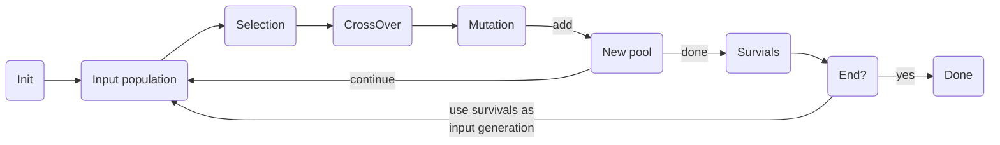

# galgogene

Galgogene is a simple implementation of a [genetic algorithm](https://en.wikipedia.org/wiki/Genetic_algorithm).

## Roadmap

* [ ] simplify survivors methods

## Getting started

For more example, see [/galgogene/example](https://github.com/sbiemont/galgogene/tree/master/example)

See [annex](#annex) for general information about the main algorithm.

## The operators

Before creating an engine, operators have to be defined:

* [Initializer](#initializer-operator): initializes a new set of bits for a new  individual
* [Selection](#selection-operator): selection method to fetch one individual from the population
* [CrossOver](#crossover-operator): crossover method applied on the chosen individuals
* [Mutation](#mutation-operator): mutation method applied after crossover
* [Survivor](#survivor-operator): mutated individuals are added of the new pool, only select some "survivors"
* [Termination](#termination-operator): ending conditions

### Initializer operator

Initializes a set of bits for a new individual (during initialization step)

initializer | description | parameters
----------- | ----------- | ----------
`RandomInitializer` | Builds a list of full random bits (**default initializer**) | `MaxValue`: the maximum value to be stored
`PermuationInitializer` | Builds a list of shuffled permuations

```go
// New random initializer with max value = 1
init := gene.NewRandomInitializer(1),
```

### Selection operator

This operator is used to select individuals from the population, each time the selection process is triggered.

selection | description | parameters
-------- | ----------- | ----------
`SelectionRoulette` | Fitness proportionate selection
`SelectionTournament` | Select *K* fighters and keep the best one | `Fighters`: number of fighters in a tournament

```go
// New simple selection
selection := operator.SelectionRoulette{}
```

It is also possible to have an **ordered** list of selections using `MultiSelection`.
Each selection has a probability to be used: if the first selection is not chosen, try the second one and so on.
If no selection has been chosen, an error will be raised by the `Engine`.
Use the `NewMultiSelection()` for consistency to avoid any further error.

For example, create a `Multiselection`:

```go
// New multi selection
selection, err := operator.NewMultiSelection([]operator.ProbaSelection{
  operator.NewProbaSelection(0.5, operator.SelectionRoulette{}),            // 50% chance to use wheel roulette selection
  operator.NewProbaSelection(1, operator.SelectionTournament{Fighters: 3}), // Otherwise, use tournament selection
})

if err != nil{
  // Check for error
}
```

### Crossover operator

Once individuals have been chosen, apply a crossover on pairs of individuals to generate 2 new individuals.

crossover | description | parameters
-------- | ----------- | ----------
`OnePointCrossOver` | crossover with 1 randomly chosen point
`TwoPointsCrossOver` | crossover with 2 randomly chosen points
`UniformCrossOver` | bit by bit crossover from both parents with an equal probability of beeing chosen
`DavisOrderCrossOver` | Davis' order crossover (PX0), permutation that keep the entire list of values
`UniformOrderCrossOver` | Uniform order crossover (PX1), permutation that keep the entire list of values

```go
// New simple crossover
crossover := operator.OnePointCrossOver{}
```

It is also possible to apply an **ordered** list of crossovers using `MultiCrossOver`.

```go
// New multi crossover
crossover := operator.MultiCrossOver{
  NewProbaCrossOver(0.05, operator.UniformCrossOver{}), // 5% chance for the uniform crossover to happen
  NewProbaCrossOver(1, operator.OnePointCrossOver{}),   // 100% chance for the one-point crossover to happen
}
```

### Mutation operator

Once crossover(s) have been applied, apply a mutation like a simple random bits change.

mutation | description | parameters
-------- | ----------- | ----------
`UniformMutation` | random mutation of bits (each bit has 50% chance to be changed)

```go
// New simple mutation
mutation := operator.OnePointCrossOver{}
```

It is also possible to apply an **ordered** list of mutations using `MultiMutation`.
Each mutation has its own probability (in [0 ; 1]) of being applied.

All mutations are triggered one by one, so, if probabilities are too small, it may possible to have no mutation applied and the unchanged individuals will be part of the next generation.

* `0`: the mutation will **never** be applied
* `1`: the mutation will **always** be applied

```go
// New multi mutation
mutation := operator.MultiMutation{
  NewProbaMutation(0.05, operator.UniformMutation{}),  // 5% chance for the mutation to happen
}
```

### Survivor operator

Once chosen individuals have been mutated, they are injected in the next generation population.
It is now time to select individuals from this new generation.

survivor | description | parameters
-------- | ----------- | ----------
`SurvivorAddAllParents` | add all parents individuals to the surviving population
`SurvivorAddParentsElite` | adds the *K* parents elite to the surviving population | `K`: number of individuals
`SurvivorElite` | only selects the *K* elite from the surviving population (if *K* is 0, the same population size is kept) | `K`: number of individuals

```go
// New simple surviving operator
survivor := operator.SurvivorElite{}
```

It is also possible to apply an **ordered** list of surviving actions

```go
// New multi surviving operator
survivor := operator.MultiSurvivor{
  SurvivorAddParentsElite{K: 2},  // First, add 2 parent elite to the new generation (elitism is not so good for individuals diversity)
  SurvivorElite{},                // Then, only keep the best individuals in the new generation
}
```

### Termination operator

Define an ending operator that check if processing can be stopped.

termination | description | parameters
----------- | ----------- | ----------
`TerminationGeneration` | should end processing when the *K*<sup>th</sup> generation is reached | `K`: max generation to be reached
`TerminationImprovement` | should end processing when the total fitness has not increased since the previous generation | `K`: the number of generations that the improvement has to remain steady (default: 1)
`TerminationAboveFitness` | should end processing when the elite reaches the defined fitness | `Fitness`: min fitness
`TerminationDuration` | should end processing when the total duration of each generation reaches a maximum | `Duration`: max duration

```go
// New simple termination operator
termination := operator.TerminationGeneration{K: 50}
```

It is also possible to check a list of possible ending conditions, using a `MultiTermination`.

```go
// New multi termination operator
termination := operator.MultiTermination{
  operator.TerminationGeneration{K: 50},                    // Check if generation #50 is reached
  operator.TerminationAboveFitness{Fitness: 1},             // Check if Fitness=1 is reached
  operator.TerminationDuration{Duration: 10 * time.Second}, // Check that the sum of computation time of each generation is limited to 10s
}
```

## The engine

An engine combines all [operators](#the-operators) and
an optional custom user action (`OnNewGeneration`) called each time a new generation is ready.

### Simple engine

Define minimalistic operators for an engine, without the custom action.

```go
eng := engine.Engine{
  Selection: operator.SelectionRoulette{},              // Simple selection
  Mutation:  operator.UniformCrossOver{},               // Simple mutation
  Survivor:  operator.SurvivorElite{},                  // Simple survivor (with default parameter)
  Termination:    &operator.TerminationAboveFitness{Fitness: 1.0},  // Simple termination condition
}
```

### Complex engine

Define all multi operators with a custom user action.

```go
eng := Engine{
  Initializer: nil, // Use default random initializer
  Selection: operator.MultiSelection{
    operator.NewProbaSelection(0.5, operator.SelectionRoulette{}),            // 50% chance to use roulette selection
    operator.NewProbaSelection(1, operator.SelectionTournament{Fighters: 3}), // Otherwise, use tournament selection with 3 fighters
  },
  CrossOver: operator.MultiCrossOver{
    operator.NewProbaCrossOver(1, operator.UniformCrossOver{}),   // 100% chance to apply uniform crossover
  },
  Mutation: operator.MultiMutation{
    operator.NewProbaMutation(0.1, operator.UniformMutation{}),  // 10% chance to also apply a crossover, each bit has 50% chance to be changed
  }
  Survivor: operator.MultiSurvivor{
    operator.SurvivorAddParentsElite{K: 2}, // Add 2 elite parent's individuals to the new generation
    operator.SurvivorElite{},               // Then, only keep best individuals to create the new population
  },
  Termination: operator.MultiTermination{
    &operator.TerminationGeneration{K: 50},               // Stop at generation #50
    &operator.TerminationImprovement{},                   // Or stop if total fitness has not been improved
    &operator.TerminationAboveFitness{Fitness: 1},        // Or stop if Fitness=1 is reached
    &operator.TerminationDuration{Duration: time.Second}, // Or stop if total computation time of generations has reached 1s
  },
  OnNewGeneration: func(pop gene.Population) { // OnNewGeneration is called each time a new generation is produced
    elite := pop.Elite()
    fmt.Printf(
      "Generation #%d, fit: %f, tot: %f, str: %s\n",
      pop.Stats.GenerationNb, elite.Fitness, pop.Stats.TotalFitness, string(elite.Code.ToBytes()),
    )
  },
}
```

### Run the engine

Launch processing using `Run`. It will return:

* an error if process failed
* the ending condition raised
* the last population generated

```go
popSize := 100 // nb of individuals in init population
bitsSize := 20 // nb of bits for each individual
var fitness gene.FitnessFct = func(bits gene.Bits) float64 {
  // custom fitness function of a code of `bitsSize` bits
  return 1
}

last, termination, err := eng.Run(popSize, bitsSize, fitness)
// err:   not nil if an error occurred
// termination: the termination condition used to stop processing (can be ignored)
// last:  the last generation
```

## Annex

Here is the general algorithm explained using pseudo code:

```raw
pop = init population of n individuals using initializer
loop until terminating condition found {
  pop' = new empty population
  loop on arbitrary k {
    select individual1 from pop
    select individual2 from pop

    cross individual1 with individual2 to create individual1' and individual2'
    mutate individual1' to create individual1''
    mutate individual2' to create individual2''
    add individual1'' and individual2'' to pop'
  }
  choose survivors from pop'
  pop = pop' (pop become is the new generation)
}
return pop
```

The full process:


