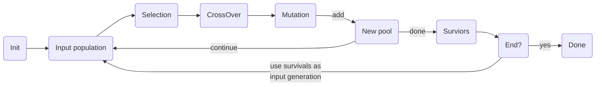

# galgogene

Galgogene is a simple implementation of a [genetic algorithm](https://en.wikipedia.org/wiki/Genetic_algorithm).

## Getting started

For more example, see [/galgogene/example](https://github.com/sbiemont/galgogene/tree/master/example)

See [annex](#annex) for general information about the main algorithm.

## Roadmap

* [ ] Force `Otherwise` method to be called for `Selection` and `Survivors`

## The operators

Before creating an engine, operators have to be defined:

* [Initializer](#initializer-operator): initializes a new set of bits for a new  individual
* [Selection](#selection-operator): selection method to fetch one individual from the population
* [CrossOver](#crossover-operator): crossover method applied on the chosen individuals
* [Mutation](#mutation-operator): mutation method applied after crossover
* [Survivor](#survivor-operator): mutated individuals are added of the new pool, only select some "survivors"
* [Termination](#termination-operator): ending conditions

### Initializer operator

Initializes a set of bits for a new individual (during initialization step)

initializer | description | parameters
----------- | ----------- | ----------
`RandomInitializer` | Builds a list of full random bits | `MaxValue`: the maximum value to be stored
`PermuationInitializer` | Builds a list of shuffled indexes in [0 ; bits length[

```go
// New random initializer with max value = 1
init := gene.NewRandomInitializer(1)
```

### Selection operator

This operator is used to select an individual from the population, each time the selection process is triggered.

selection | description | parameters
-------- | ----------- | ----------
`RouletteSelection`   | Fitness proportionate selection
`TournamentSelection` | Select *K* fighters and keep the best one | `Fighters`: number of fighters in a tournament

```go
// New simple selection
selection := operator.RouletteSelection{}
```

It is also possible to have an **ordered** list of selections using `MultiSelection`.
Each selection has a probability to be used: if the first selection is not chosen, try the second one and so on.
If no selection has been chosen, the default one is used (an error will be raised by the `Engine` if no default selection is defined).

For example, create a `Multiselection`:

```go
// New multi selection
selection := operator.MultiSelection{}.
  Use(0.5, operator.RouletteSelection{}).              // 50% chance to use wheel roulette selection
  Otherwise(operator.TournamentSelection{Fighters: 3}) // Otherwise, use tournament selection
```

### Crossover operator

Once individuals have been chosen, apply a crossover on pairs of individuals to generate 2 new individuals.

Notes:

* standard crossovers will mix values from both parents to create 2 new children
* permutation crossovers will reorder values without changing them

crossover | description | parameters
-------- | ----------- | ----------
`OnePointCrossOver`  | Crossover with 1 randomly chosen point
`TwoPointsCrossOver` | Crossover with 2 randomly chosen points
`UniformCrossOver`   | Bit by bit crossover (with an equal probability of beeing chosen)
`DavisOrderCrossOver` | Davis' order crossover (PX0), **permutation** that reorder the list of values
`UniformOrderCrossOver` | Uniform order crossover (PX1), **permutation** that reorder the list of values

```go
// New simple crossover
crossover := operator.OnePointCrossOver{}
```

It is also possible to apply an **ordered** list of crossovers using `MultiCrossOver`.
Note that all (or none) crossover may be applied depending on the probability rates defined.

```go
// New multi crossover
crossover := operator.MultiCrossOver{}.
  Use(0.05, operator.UniformCrossOver{}). // 5% chance for the uniform crossover to happen
  Use(0.75, operator.OnePointCrossOver{}) // 75% chance for the one-point crossover to happen
```

### Mutation operator

Once crossover(s) have been applied, apply a mutation like a simple random bits change.

Notes:

* a **mutation** overrides some bits with new random values
* a **permutation** randomly reorders some bits (without changing the values)

mutation | description | parameters
-------- | ----------- | ----------
`UniqueMutation`  | Randomly choose one unique bit and change its value
`UniformMutation` | Random mutation of bits (each bit has 50% chance to be changed)
`SwapPermutation`      | Random swap of 2 bits
`InversionPermutation` | Randomly picks 2 points and inverts the subtour (eg.: `AB.CDEF.GH` will become `AB.FEDC.GH`)
`SramblePermutation`   | Randomly picks 2 points and shuffles the subtour (eg.: `AB.CDEF.GH` will become `AB.ECFD.GH`)

```go
// New simple mutation
mutation := operator.UniformMutation{}
```

It is also possible to apply an **ordered** list of mutations using `MultiMutation`.
Each mutation has its own probability (in [0 ; 1]) of being applied.

All mutations are triggered one by one, so, if probabilities are too small, it may possible to have no mutation applied and the unchanged individuals will be part of the next generation.

* `0`: the mutation will **never** be applied
* `1`: the mutation will **always** be applied

```go
// New multi mutation
mutation := operator.MultiMutation{}.
  Use(0.01, operator.UniformMutation{}). // 1% chance for the mutation to happen
  Use(0.05, operator.UniqueMutation{})   // 5% chance for the mutation to happen
```

### Survivor operator

Once chosen individuals have been mutated, they are injected in the next generation population.
It is now time to select individuals from this new generation.

survivor | description | parameters
-------- | ----------- | ----------
`EliteSurvivor` | Select the elite from the surviving population
`RankSurvivor`  | Select the individual with the smallest ranks
`ChildrenSurvivor` | Keep the children in the new generation (limited to the parent pool size)

```go
// New simple surviving operator
survivor := operator.EliteSurvivor{}
```

It is also possible to apply an **ordered** list of surviving actions, closing with `Otherwise`.

```go
// New multi surviving operator
survivor := operator.MultiSurvivor{}.
  Use(0.75, EliteSurvivor{}).    // Only keep the best individuals in the new generation
  Use(0.25, RankSurvivor{}).     // Or, only keep the least ranked individuals in the new generation
  Otherwise(ChildrenSurvivor{})  // Otherwise, only keep new generated children
```

### Termination operator

Define an ending operator that check if processing can be stopped.

termination | description | parameters
----------- | ----------- | ----------
`GenerationTermination` | Processing will end when the *K*<sup>th</sup> generation is reached | `K`: max generation to be reached
`ImprovementTermination` | Processing will end when the total fitness has not increased since the previous generation | `K`: the number of generations that the improvement has to remain steady (default: 1)
`FitnessTermination`  | Processing will end when the elite reaches the defined fitness | `Fitness`: min fitness
`DurationTermination` | Processing will end when the total duration of each generation reaches a maximum | `Duration`: max duration

```go
// New simple termination operator
termination := operator.GenerationTermination{K: 50}
```

It is also possible to check a list of possible ending conditions, using a `MultiTermination`.

```go
// New multi termination operator
termination := operator.MultiTermination{}.
  Use(operator.GenerationTermination{K: 50}).                   // Check if generation #50 is reached
  Use(operator.FitnessTermination{Fitness: 1}).                 // Check if Fitness=1 is reached
  Use(operator.DurationTermination{Duration: 10 * time.Second}) // Check that the sum of computation time of each generation is limited to 10s
```

## The engine

An engine combines all [operators](#the-operators) and
an optional custom user action (`OnNewGeneration`) called each time a new generation is ready.

### Simple engine

Define minimalistic operators for an engine, without the custom action.

```go
eng := engine.Engine{
  Selection:   operator.RouletteSelection{},               // Simple selection
  CrossOver:   operator.UniformCrossOver{},                // Simple crossover
  Survivor:    operator.EliteSurvivor{},                   // Simple survivor
  Termination: &operator.FitnessTermination{Fitness: 1.0}, // Simple termination condition
}
```

### Complex engine

Define all multi operators with a custom user action.

```go
eng := engine.Engine{
  Initializer: nil, // Use default random initializer with max value = 1
  Selection: operator.MultiSelection{}.
    Use(0.5, operator.RouletteSelection{}).               // 50% chance to use roulette selection
    Otherwise(operator.TournamentSelection{Fighters: 3}), // Otherwise, use tournament selection with 3 fighters
  CrossOver: operator.MultiCrossOver{}.
    Use(1, operator.UniformCrossOver{}),  // 100% chance to apply uniform crossover
  Mutation: operator.MultiMutation{}.
    Use(0.1, operator.UniformMutation{}), // 10% chance to apply a mution, each bit has 50% chance to be changed
  Survivor: operator.MultiSurvivor{}.
    Use(0.1, operator.RankSurvivor{}).    // 10% to use the ranking selection
    Otherwise(operator.EliteSurvivor{}),  // Otherwise, only keep best individuals to create the new population
  Termination: operator.MultiTermination{}.
    Use(&operator.GenerationTermination{K: 50}).               // Stop at generation #50
    Use(&operator.ImprovementTermination{}).                   // Or stop if total fitness has not been improved
    Use(&operator.FitnessTermination{Fitness: 1}).             // Or stop if Fitness=1 is reached
    Use(&operator.DurationTermination{Duration: time.Second}), // Or stop if total computation time of generations has reached 1s
  OnNewGeneration: func(pop gene.Population) { // OnNewGeneration is called each time a new generation is produced
    elite := pop.Elite()
    fmt.Printf(
      "Generation #%d, fit: %f, tot: %f, str: %s\n",
      pop.Stats.GenerationNb,
      elite.Fitness,
      pop.Stats.TotalFitness,
      string(elite.Code.ToBytes()),
    )
  },
}
```

### Run the engine

Launch processing using `Run`.

Input parameters required:

parameter | definition
--------- | ----------
`popSize`  | The number of individuals in each generation
`bitsSize` | The number of bits for each individual
`fitness`  | The fitness method used to evaluate an individual<br>The result has to **increase** with the fact that the individual is **fitted** for the current problem.

It will return:

parameter | definition
--------- | ----------
`last`        | The last population generated
`termination` | The ending condition raised
`err`         | An error if process failed

```go
popSize := 100 // nb of individuals in init population
bitsSize := 20 // nb of bits for each individual
var fitness gene.FitnessFct = func(bits gene.Bits) float64 {
  // custom fitness function of a code of `bitsSize` bits
  return 1
}

last, termination, err := eng.Run(popSize, bitsSize, fitness)
// last: the last generation
// termination: the termination condition used to stop processing (can be ignored)
// err: not nil if an error occurred
```

## Annex

Here is the general algorithm explained using pseudo code:

```raw
pop = init population of n individuals using initializer
loop until terminating condition found {
  pop' = new empty population
  loop on arbitrary k {
    select individual1 from pop
    select individual2 from pop

    cross individual1 with individual2 to create individual1' and individual2'
    mutate individual1' to create individual1''
    mutate individual2' to create individual2''
    add individual1'' and individual2'' to pop'
  }
  choose survivors from pop'
  pop = pop' (pop become is the new generation)
}
return pop
```

The full process:


