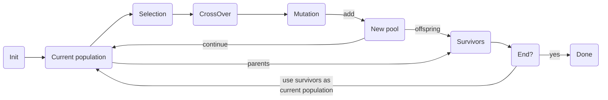

# galgogene

Galgogene is a simple implementation of a [genetic algorithm](https://en.wikipedia.org/wiki/Genetic_algorithm).

## Getting started

Check the [examples](https://github.com/sbiemont/galgogene/tree/master/example), and run them:

```shell
make example1 # Find a simple input string using a minimalistic engine
make example2 # Find a more complex string using a custom engine
make example3 # Find a solution to the traveling salesman problem (with ~30 cities)
```

These examples may not find the best solution. Your turn to customise them !

See [annex](#annex) for general information about the main algorithm.

## Roadmap

- [ ] improve PMX to be used with duplicated values

## The operators

Before creating an engine, operators have to be defined:

operator | description
-------- | -----------
[Initializer](#initializer-operator) | initializes a new chromosome to create a new individual
[Selection](#selection-operator)     | selection method to fetch one individual from the population
[CrossOver](#crossover-operator)     | crossover method applied on the chosen individuals
[Mutation](#mutation-operator)       | mutation method applied after crossover
[Survivor](#survivor-operator)       | mutated individuals are added of the new pool, only select some "survivors"
[Termination](#termination-operator) | ending conditions
[Fitness](#fitness-function)         | core fitness function

**Note** that some operators are **incompatible** with each others.
Use a [factory](#engine-with-a-factory) to ensure that the right operators are instanciated.

### Initializer operator

Create an initializer that defines the rules to build a chromosome of a given size.

initializer              | description | parameters
------------------------ | ----------- | ----------
`RandomInitializer`      | Builds a chromosome of a given size with random values in [0 ; MaxValue[ | `MaxValue`: the maximum value to be stored
`PermutationInitializer` | Builds a chromosome of shuffled indexes in [0 ; size[

```go
// New random initializer to create chromosomes with 0 and 1
init := gene.RandomInitializer{MaxValue: 1}
```

To create a custom `Initializer`, implement this function to match the interface:

```go
func Init(chrmSize int) (Chromosome, error) { ... }
```

### Selection operator

This operator is used to select an individual from the population, each time the selection process is triggered.

selection             | description | parameters
--------------------- | ----------- | ----------
`RouletteSelection`   | Fitness proportionate selection
`TournamentSelection` | Select $K$ fighters and keep the best one | `Fighters`: number of fighters in a tournament
`EliteSelection`      | Select the best individual of the current population
`MultiSelection`      | Configure a set of different selections (see below)

```go
// New simple selection
selection := operator.RouletteSelection{}
```

It is also possible to have an **ordered** list of selections using `MultiSelection`.
Each selection has its own probability to be triggered (in [0 ; 1]): if the first selection is not chosen, try the second one and so on.
If no selection has been chosen, the default one is used.

For example, create a `MultiSelection`, call `Use` to stack selections and close using `Otherwise`:

```go
// New multi selection
selection := operator.MultiSelection{}.
  Use(0.5, operator.RouletteSelection{}).              // 50% chance to use wheel roulette selection
  Use(0.1, operator.EliteSelection{}).                 // 10% chance to use the elite selection
  Otherwise(operator.TournamentSelection{Fighters: 3}) // Otherwise, use tournament selection
```

To create a custom `Selection`, implement this function to match the interface:

```go
func Select(pop gene.Population) (gene.Individual, error) { ... }
```

### Crossover operator

Once individuals have been chosen, apply a crossover on pairs of individuals to generate 2 new individuals.

Notes:

* standard crossovers will mix values from both parents to create 2 new children
* permutation crossovers will reorder the values without changing them (some permutation may crash if duplicated values are found)

crossover                 | description | parameters
------------------------- | ----------- | ----------
`OnePointCrossOver`       | Crossover with 1 randomly chosen point
`TwoPointsCrossOver`      | Crossover with 2 randomly chosen points
`UniformCrossOver`        | Bit by bit crossover (with an equal probability of beeing chosen)
`DavisOrderCrossOver`     | Davis' order crossover (PX0), **permutation** that reorder the list of values
`UniformOrderCrossOver`   | Uniform order crossover (PX1), **permutation** that reorder the list of values
`PartiallyMatchCrossOver` | Partially matched/mapped crossover (PMX), **permutation** that reorder the list of values<br>Note that duplicated values in the chromosome cannot be used and may lead to a crash (infinite loop)
`MultiCrossOver`          | Configure a set of different crossovers (see below)

```go
// New simple crossover
crossover := operator.OnePointCrossOver{}
```

It is also possible to apply an **ordered** list of crossovers using `MultiCrossOver`.
Each crossover has its own probability (in [0 ; 1]) of being applied.

Note that all (or none) crossover may be applied depending on the probability rates defined.
By default, only one crossover is applied (the first to be triggered).
If you need to run through all crossovers, set the `ApplyAll` parameter to `true`.

```go
// New multi crossover
crossover := operator.MultiCrossOver{ApplyAll: true}.
  Use(0.05, operator.UniformCrossOver{}). // 5% chance for the uniform crossover to happen
  Use(0.75, operator.OnePointCrossOver{}) // 75% chance for the one-point crossover to happen
```

To create a custom `CrossOver`, implement this function to match the interface:

```go
func Mate(chrm1, chrm2 gene.Chromosome) (gene.Chromosome, gene.Chromosome) { ... }
```

### Mutation operator

Once crossover(s) have been applied, apply a mutation on the chromosome of the newly created individuals.

Notes:

* a **mutation** overrides some bases with new random values
* a **permutation** randomly reorders some bases (without changing the values)

mutation               | description | parameters
---------------------- | ----------- | ----------
`UniqueMutation`       | Randomly choose one unique base and change its value
`UniformMutation`      | Random mutation of bases (each base has 50% chance to be changed)
`SwapPermutation`      | Random swap of 2 bases
`InversionPermutation` | Randomly picks 2 points and inverts the subtour (eg.: `AB.CDEF.GH` will become `AB.FEDC.GH`)
`ScramblePermutation`  | Randomly picks 2 points and shuffles the subtour (eg.: `AB.CDEF.GH` will become `AB.ECFD.GH`)
`MultiMutation`        | Configure a set of different mutations (see below)

```go
// New simple mutation
mutation := operator.UniformMutation{}
```

It is also possible to apply an **ordered** list of mutations using `MultiMutation`.
Each mutation has its own probability (in [0 ; 1]) of being applied.

All mutations are triggered one by one, so, if probabilities are too small, it may be possible to have no mutation applied and the unchanged individuals will be part of the offspring population.
By default, only one mutation is applied (the first one to be triggered).
If you need to run through all mutations, set the `ApplyAll` parameter to `true`.

```go
// New multi mutation
mutation := operator.MultiMutation{ApplyAll: true}.
  Use(0.01, operator.UniformMutation{}). // 1% chance for the mutation to happen
  Use(0.05, operator.UniqueMutation{})   // 5% chance for the mutation to happen
```

To create a custom `Mutation`, implement this function to match the interface:

```go
func Mutate(chrm gene.Chromosome) gene.Chromosome { ... }
```

### Survivor operator

Once chosen individuals have been mutated, they are injected in the offspring population.
It is now time to select individuals to create a new generation.

survivor           | description | parameters
------------------ | ----------- | ----------
`EliteSurvivor`    | Select the elites in the parent and offspring population
`RankSurvivor`     | Select the individuals with the smallest ranks (newest individuals)
`RandomSurvivor`   | Select random survivors in the parent and offspring population (it may lead to problems of convergence)
`MultiSurvivor`    | Configure a set of different surviving behaviors (see below)

```go
// New simple surviving operator
survivor := operator.EliteSurvivor{}
```

Call `Use` to apply an **ordered** list of surviving actions, closing with `Otherwise`.
Each survivor method has its own probability (in [0 ; 1]) of being applied.

All methods are triggered one by one: if the first surviving method is not chosen, try the second one and so on.
If no method has been chosen, the default one is used.

```go
// New multi surviving operator
survivor := operator.MultiSurvivor{}.
  Use(0.75, operator.EliteSurvivor{}). // 75% chance to keep the best individuals in the new generation
  Use(0.25, operator.RankSurvivor{}).  // Or, 25% chance to keep the least ranked individuals in the new generation
  Otherwise(operator.RandomSurvivor{}) // Otherwise, select random individuals
```

To create a custom `Survivor`, implement this function to match the interface:

```go
func Survive(parents gene.Population, offsprings gene.Population) gene.Population
```

### Termination operator

Define an ending operator that checks if processing can be stopped.

termination              | description | parameters
------------------------ | ----------- | ----------
`GenerationTermination`  | Processing will end when the $K^{th}$ generation is reached | `K`: max generation to be reached
`ImprovementTermination` | Processing will end when the total fitness has not increased since the previous generation | `K`: the number of generations that the improvement has to remain steady (default: 1)
`FitnessTermination`     | Processing will end when the elite reaches the defined fitness | `Fitness`: min fitness
`DurationTermination`    | Processing will end when the total duration of each generation reaches a maximum | `Duration`: max duration
`MultiTermination`       | Configure a set of different terminations (see below)

```go
// New simple termination operator
termination := &operator.GenerationTermination{K: 50}
```

It is also possible to check a list of possible ending conditions, using a `MultiTermination`.

```go
// New multi termination operator
termination := operator.MultiTermination{}.
  Use(&operator.GenerationTermination{K: 50}).                   // Check if generation #50 is reached
  Use(&operator.FitnessTermination{Fitness: 1}).                 // Check if Fitness=1 is reached
  Use(&operator.DurationTermination{Duration: 10 * time.Second}) // Check that the sum of computation time of each generation is limited to 10s
```

To create a custom `Termination`, implement this function to match the interface:

```go
func End(pop gene.Population) Termination { ... }
```

### Fitness function

The fitness function is used to evaluate an individual.
Its result has to **increase** with the fact that the individual is **fitted** for the current problem.
If the solution is to minimise $x$, inverse it to maximise the fitness ($fitness=1/x$)

For example, a pure custom function could be:

```go
// maximize the number of '42' in the chromosome
var fitness gene.Fitness = func(chrm gene.Chromosome) float64 {
  var fit float64
  for _, it := range chrm.Raw {
    if it == 42 {
      fit += 1
    }
  }
  return fit / float64(chrm.Len()) // optional: normalize the result
}
```

## The engine

An engine combines:

* all [operators](#the-operators)
* an optional custom user action (`OnNewGeneration`) called each time a new generation is ready

### Simple engine

This example defines minimalistic operators for an engine, without the custom action.

```go
eng := engine.Engine{
  Initializer: gene.RandomInitializer{MaxValue: 1},          // Simple initializer with max value = 1
  Selection:   operator.RouletteSelection{},                 // Simple selection
  CrossOver:   operator.UniformCrossOver{},                  // Simple crossover
  Survivor:    operator.EliteSurvivor{},                     // Simple survivor
  Termination: &operator.FitnessTermination{Fitness: 1.0},   // Simple termination condition
  Fitness:     func(_ gene.Chromosome) float64 { return 0 }, // Fitness function to be defined
}
```

### Complex engine

This example defines all multi operators with a custom user action.

```go
eng := engine.Engine{
  Initializer: gene.RandomInitializer{MaxValue: 1}, // Use default random initializer with max value = 1
  Selection: operator.MultiSelection{}.
    Use(0.5, operator.RouletteSelection{}).               // 50% chance to use roulette selection
    Otherwise(operator.TournamentSelection{Fighters: 3}), // Otherwise, use tournament selection with 3 fighters
  CrossOver: operator.MultiCrossOver{}.
    Use(1, operator.UniformCrossOver{}), // 100% chance to apply uniform crossover
  Mutation: operator.MultiMutation{}.
    Use(0.1, operator.UniformMutation{}), // 10% chance to apply a mution, each bit has 50% chance to be changed
  Survivor: operator.MultiSurvivor{}.
    Use(0.1, operator.RankSurvivor{}).   // 10% to use the ranking selection
    Otherwise(operator.EliteSurvivor{}), // Otherwise, only keep best individuals to create the new population
  Termination: operator.MultiTermination{}.
    Use(&operator.GenerationTermination{K: 50}).               // Stop at generation #50
    Use(&operator.ImprovementTermination{}).                   // Or stop if total fitness has not been improved
    Use(&operator.FitnessTermination{Fitness: 1}).             // Or stop if Fitness=1 is reached
    Use(&operator.DurationTermination{Duration: time.Second}), // Or stop if total computation time of generations has reached 1s
  Fitness: func(_ gene.Chromosome) float64 { return 0 }, // Fitness function to be defined
  OnNewGeneration: func(pop gene.Population) { // OnNewGeneration is called each time a new generation is produced
    elite := pop.Elite()
    fmt.Printf(
      "Generation #%d, fit: %f, tot: %f, str: %s\n",
      pop.Stats.GenerationNb,
      elite.Fitness,
      pop.Stats.TotalFitness,
      string(elite.Code.Raw),
    )
  },
}
```

### Engine with a factory

Permutations and random values cannot be used in the same engine.
Use a `Permutation` or a `Random` factory to select only methods for the chosen strategy.

```go
f := factory.Permutation{} // Choose the factory

eng := engine.Engine{
  Initializer: f.Initializer.Permutation(), // Init all operators using it
  Selection: f.Selection.Multi().
    Use(0.01, f.Selection.Elite()).
    Otherwise(f.Selection.Roulette()),
  CrossOver: f.CrossOver.UniformOrder(),
  Mutation:  f.Mutation.Scramble(),
  Survivor:  f.Survivor.Rank(),
  Termination: f.Termination.Multi().
    Use(f.Termination.Generation(1000)).
    Use(f.Termination.Duration(5 * time.Second)),
  Fitness: func(_ gene.Chromosome) float64 { return 0 },
}
```

### Run the engine

Launch processing using `Run` with these nput parameters:

parameter        | definition
---------------- | ----------
`popSize`        | The number of individuals in each generation
`offspringSize`  | The number of individuals in the offspring population<br>Note: if the `offspringSize` < `popSize`, each generated population will still have `popSize` individuals in it
`chromosomeSize` | Number of bases in a chromosome (in one individual)

It will return a `Solution` (and an error if any):

parameter      | definition
-------------- | ----------
`PopWithBestIndividual`   | The population with the best individual (with the maximum fitness)
`PopWithBestTotalFitness` | The best population (with the maximum total fitness computed)
`Termination`             | The ending condition raised

```go
// Run the engine
popSize := 100
offspringSize := 50
chromosomeSize = 10
solution, err := eng.Run(popSize, offspringSize, chromosomeSize)
```

## Annex

Here is the general algorithm explained using pseudo code:

```raw
pop = init population of n individuals using initializer
loop until terminating condition found {
  pop' = new empty population
  loop on arbitrary k {
    select individual1 from pop
    select individual2 from pop

    cross individual1 with individual2 to create individual1' and individual2'
    mutate individual1' to create individual1''
    mutate individual2' to create individual2''
    add individual1'' and individual2'' to pop'
  }
  choose survivors from pop'
  pop = pop' (pop become is the new generation)
}
return pop
```

The full process:


