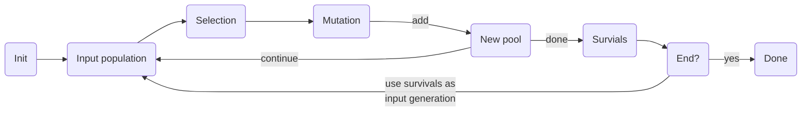

# galgogene

Galgogene is a simple implementation of a [genetic algorithm](https://en.wikipedia.org/wiki/Genetic_algorithm).

## Roadmap

* [ ] add examples

## Getting started

For more example, see [/galgogene/example](https://github.com/sbiemont/galgogene/tree/master/example)

See [annex](#annex) for general information about the main algorithm.

## The operators

Before creating an engine, operators have to be defined:

* [Selection](#selection-operator): selection method to fetch one individual from the population
* [Mutation](#mutation-operator): mutation method applied on the chosen individuals
* [Survivor](#survivor-operator): mutated individuals are added of the new pool, only select some "survivors"
* [Ender](#ender-operator): ending conditions

### Selection operator

This operator is used to select individuals from the population, each time the selection process is triggered.

selector | description | parameters
-------- | ----------- | ----------
`SelectorRoulette` | Fitness proportionate selection
`SelectorTournament` | Select *K* fighters and keep the best one | `Fighters`: number of fighters in a tournament

```go
// New simple selector
selector := operator.SelectorRoulette{}
```

It is also possible to have an **ordered** list of selectors using `MultiSelector`.
Each selector has a probability to be used: if the first selector is not chosen, try the second one and so on.
If no selector has been chosen, an error will be raised by the `Engine`.
Use the `NewMultiSelector()` for consistency to avoid any further error.

For example, create a `Multiselector`:

```go
// New multi selector
selector, err := operator.NewMultiSelector([]operator.ProbaSelector{
  operator.NewProbaSelector(0.5, operator.SelectorRoulette{}),            // 50% chance to use wheel roulette selection
  operator.NewProbaSelector(1, operator.SelectorTournament{Fighters: 3}), // Otherwise, use tournament selection
})

if err != nil{
  // Check for error
}
```

### Mutation operator

Once individuals have been chosen, apply a mutation like a cross-over or a simple random bits mutation.

mutator | description | parameters
-------- | ----------- | ----------
`OnePointCrossOver` | cross-over with 1 randomly chosen point
`TwoPointsCrossOver` | cross-over with 2 randomly chosen points
`UniformCrossOver` | bit by bit cross-over from both parents with an equal probability of beeing chosen
`Mutate` | random mutation of bits | `Rate`: mutation rate in [0 ; 1] (each bit has a chance to be changed, but it can be left unchanged)
`Invert` | random invertion of bits | `Rate`: invertion rate in [0 ; 1] (once chosen, the bit will be inverted)

```go
// New simple mutator
mutator := operator.OnePointCrossOver{}
```

It is also possible to apply an **ordered** list of mutations using `MultiMutator`.
Each mutation has its own probability (in [0 ; 1]) of being applied.

All mutations are triggered one by one, so, if probabilities are too small, it may possible to have no mutation applied and the unchanged individuals will be part of the next generation.

* `0`: the mutation will **never** be applied
* `1`: the mutation will **always** be applied

```go
// New multi mutator
mutator := operator.MultiMutator{
  NewProbaMutator(0.5, operator.OnePointCrossOver{}), // 50% chance to use apply one point cross-over
  NewProbaMutator(0.05, operator.Mutate{Rate: 0.4}),  // 5% chance for the mutation to happen with a bit rate of 40%
}
```

### Survivor operator

Once chosen individuals have been mutated, they are injected in the next generation population.
It is now time to select individuals from this new generation.

survivor | description | parameters
-------- | ----------- | ----------
`SurvivorAddAllParents` | add all parents individuals to the surviving population
`SurvivorAddParentsElite` | adds the *K* parents elite to the surviving population | `K`: number of individuals
`SurvivorElite` | only selects the *K* elite from the surviving population (if *K* is 0, the same population size is kept) | `K`: number of individuals

```go
// New simple surviving operator
survivor := operator.SurvivorElite{}
```

It is also possible to apply an **ordered** list of surviving actions

```go
// New multi surviving operator
survivor := operator.MultiSurvivor{
  SurvivorAddParentsElite{K: 2},  // First, add 2 parent elite to the new generation (elitism is not so good for individuals diversity)
  SurvivorElite{},                // Then, only keep the best individuals in the new generation
}
```

### Ender operator

Define an ending operator that check if processing can be stopped.

ender | description | parameters
----- | ----------- | ----------
`EnderGeneration` | should end processing when the *K*<sup>th</sup> generation is reached | `K`: max generation to be reached
`EnderImprovement` | should end processing when the total fitness has not increased since the previous generation
`EnderAboveFitness` | should end processing when the elite reaches the defined fitness | `Fitness`: min fitness
`EnderBelowFitness` | should end processing when the elite reaches the defined fitness | `Fitness`: max fitness
`EnderDuration` | should end processing when the total duration of each generation reaches a maximum | `Duration`: max duration

```go
// New simple ender operator
ender := operator.EnderGeneration{K: 50}
```

It is also possible to check a list of possible ending conditions, using a `MultiEnder`.

```go
// New multi ender operator
ender := operator.MultiEnder{
  operator.EnderGeneration{K: 50},                    // Check if generation #50 is reached
  operator.EnderAboveFitness{Fitness: 1},             // Check if Fitness=1 is reached
  operator.EnderDuration{Duration: 10 * time.Second}, // Check that the sum of computation time of each generation is limited to 10s
}
```

## The engine

An engine combines all [operators](#the-operators) and
an optional custom user action (`OnNewGeneration`) called each time a new generation is ready.

### Simple engine

Define minimalistic operators for an engine, without the custom action.

```go
eng := engine.Engine{
  Selector: operator.SelectorRoulette{},                // Simple selector
  Mutator:  operator.UniformCrossOver{},                // Simple mutator
  Survivor: operator.SurvivorElite{},                   // Simple survivor (with default parameter)
  Ender:    &operator.EnderAboveFitness{Fitness: 1.0},  // Simple ender
}
```

### Complex engine

Define all multi operators with a custom user action.

```go
eng := Engine{
  Selector: operator.MultiSelector{
    operator.NewProbaSelector(0.5, operator.SelectorRoulette{}),            // 50% chance to use roulette selector
    operator.NewProbaSelector(1, operator.SelectorTournament{Fighters: 3}), // Otherwise, use tournament selector with 3 fighters
  },
  Mutator: operator.MultiMutator{
    operator.NewProbaMutator(1, operator.UniformCrossOver{}),   // 100% chance to apply uniform cross-over
    operator.NewProbaMutator(0.1, operator.Mutate{Rate: 0.5}),  // 10% chance to also apply a mutation, eaach bit has 50% chance to be changed
  },
  Survivor: operator.MultiSurvivor{
    operator.SurvivorAddParentsElite{K: 2}, // Add 2 elite parent's individuals to the new generation
    operator.SurvivorElite{},               // Then, only keep best individuals to create the new population
  },
  Ender: operator.MultiEnder{
    &operator.EnderGeneration{K: 50},               // Stop at generation #50
    &operator.EnderImprovement{},                   // Or stop if total fitness has not been improved
    &operator.EnderAboveFitness{Fitness: 1},        // Or stop if Fitness=1 is reached
    &operator.EnderDuration{Duration: time.Second}, // Or stop if total computation time of generations has reached 1s
  },
  OnNewGeneration: func(pop gene.Population) { // OnNewGeneration is called each time a new generation is produced
    elite := pop.Elite()
    fmt.Printf(
      "Generation #%d, fit: %f, tot: %f, str: %s\n",
      pop.Stats.GenerationNb, elite.Fitness, pop.Stats.TotalFitness, string(elite.Code.ToBytes()),
    )
  },
}
```

### Run the engine

Launch processing using `Run`. It will return:

* an error if process failed
* the ending condition raised
* the last population generated

```go
popSize := 100 // nb of individuals in init population
bitsSize := 20 // nb of bits for each individual
var fitness gene.FitnessFct = func(bits gene.Bits) float64 {
  // custom fitness function of a code of `bitsSize` bits
  return 1
}

last, ender, err := eng.Run(popSize, bitsSize, fitness)
// err:   not nil if an error occurred
// ender: the ending condition used to stop processing (can be ignored)
// last:  the last generation
```

## Annex

Here is the general algorithm explained using pseudo code:

```raw
pop = init random population of n individuals
loop until ending condition found {
  pop' = new empty population
  loop on arbitrary k {
    select individual1 from pop
    select individual2 from pop

    mutate individual1 with individual2 to create individual1' and individual2'
    add individual1' and individual2' to pop'
  }
  choose survivors from pop'
  pop = pop' (pop become is the new generation)
}
return pop
```

The full process:


